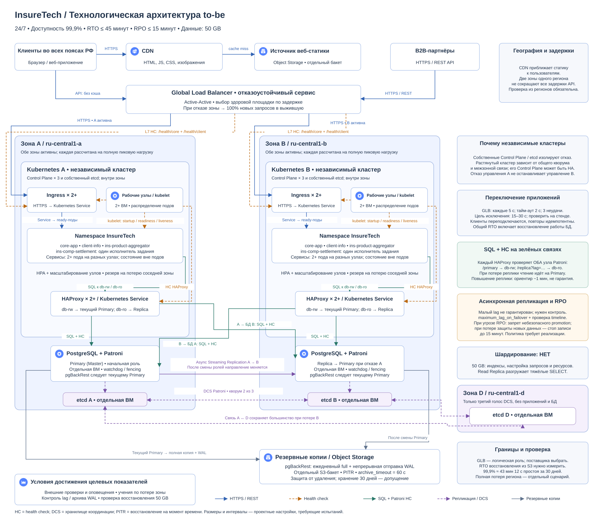

# Технологическая архитектура InsureTech

InsureTech предоставляет частным клиентам веб-приложение для выбора и оформления страховок, а партнёрам — API интеграции. Целевая архитектура распределяет приложения между двумя независимыми зонами доступности и заменяет единственную виртуальную машину PostgreSQL отказоустойчивым кластером.

[Редактируемая схема draw.io](<InureTech_технологическая архитектура_to-be.drawio>) содержит все решения на одном листе. Ниже — её обзорная копия; для чтения мелких подписей откройте изображение отдельно.

## Требования и границы решения

| Требование | Архитектурное решение |
| --- | --- |
| Работа 24/7, доступность 99,9% | Две активные площадки, независимые кластеры, резерв мощности и автоматическое переключение |
| RTO ≤ 45 минут — допустимое время восстановления | Исключение неисправной площадки из балансировки; автоматический выбор нового мастера PostgreSQL |
| RPO ≤ 15 минут — допустимая потеря последних данных | Асинхронная потоковая репликация, контроль отставания и архивирование журнала изменений |
| Быстрая загрузка во всех часовых поясах РФ | CDN — сеть доставки содержимого с кэшированием статики рядом с пользователем |
| Данные занимают 50 GB | Один логический кластер PostgreSQL без шардирования, отдельные схемы сервисов и реплика для чтения |

В исходном состоянии приложения уже работают в Kubernetes, но в одной зоне; отдельная БД развёрнута на одной виртуальной машине. Сохраняются `core-app`, `client-info`, `ins-product-aggregator` и `ins-comp-settlement`. Статическая сборка веб-приложения публикуется в объектное хранилище. Переход к событиям, новый сервис ОСАГО, GraphQL и конфигурация ограничения запросов относятся к следующим заданиям и здесь не проектируются.

## 1. Горизонтальное масштабирование и размещение

Основная стратегия — горизонтальное масштабирование: увеличение количества экземпляров приложений и рабочих узлов Kubernetes. В зонах `ru-central1-a` и `ru-central1-b` развёрнуты одинаковые наборы сервисов. Каждая зона должна иметь заранее доступную мощность для обслуживания полной расчётной пиковой нагрузки при отказе соседней зоны. Автомасштабирование помогает при росте нагрузки, но не заменяет этот резерв.

Внутри каждого кластера экземпляры сервисов, Ingress — входного HTTP-маршрутизатора — и прокси БД распределяются по разным рабочим узлам. Для приложений предусматриваются минимум две реплики, Horizontal Pod Autoscaler (HPA, автоматическое изменение числа подов) и масштабирование группы узлов. Конкретные лимиты определяются нагрузочными испытаниями после уточнения ожидаемого роста.

Вертикальное масштабирование ограничено ресурсами одного сервера и не устраняет отказ всей зоны. Его можно применять дополнительно для подбора памяти и процессоров БД. Ни вертикальное, ни горизонтальное масштабирование сами по себе не сокращают расстояние между пользователем и сервером.

CDN обслуживает HTML статического приложения, JavaScript, CSS и изображения. Источник — отдельный бакет Object Storage; версионированные ресурсы получают длительный срок кэширования, HTML — короткий срок и обновление при выпуске версии. Персональные данные и ответы API не кэшируются. Браузер и B2B-партнёры обращаются к API через общий балансировщик.

CDN уменьшает влияние географии на загрузку статики. Две зоны одного региона не являются площадками по всей России, а CDN не гарантирует буквально одинаковое время загрузки динамических страниц. Требование следует проверять по пользовательским измерениям из регионов: отдельно для статики и операций API. Числовой предел задержки и допустимый разброс в условии не заданы.

## 2. Независимые Kubernetes-кластеры

Выбраны **изолированные кластеры**, каждый со своим Control Plane — управляющими компонентами Kubernetes — и собственным хранилищем состояния etcd. Для устойчивости к отказу отдельного узла предполагаются три узла Control Plane в каждой зоне. При потере зоны её кластер может стать недоступен целиком, однако второй кластер продолжит работу независимо.

Это ограничивает область воздействия отказа или ошибки обновления. У растянутого кластера управляющие компоненты могут быть отказоустойчивыми, поэтому общий Control Plane сам по себе не означает единственный сервер или неизбежный split-brain. Однако управление всё равно зависит от общего кворума — большинства голосующих узлов — и межзонной связи. Изоляция кластеров устраняет эту общую зависимость управления. Варианты отказоустойчивого Control Plane описаны в [документации Kubernetes](https://kubernetes.io/docs/setup/production-environment/tools/kubeadm/ha-topology/).

Сервисы без состояния (stateless), то есть приложения без уникального состояния в памяти отдельного экземпляра, работают в режиме **Active-Active**: обе площадки одновременно обрабатывают запросы. Сессии и результаты операций не должны зависеть от локального диска или памяти пода. Повторные запросы оформления должны использовать ключ идемпотентности, чтобы повтор после переключения не создавал вторую страховку.

`ins-comp-settlement` размещается на обеих площадках для доступности, но периодическая задача взаиморасчётов имеет одного исполнителя: захват задания через PostgreSQL и уникальный ключ расчётного периода. Повторная отправка реестра требует идемпотентного взаимодействия со страховой компанией. Два независимых планировщика не должны выполнять одни и те же взаиморасчёты одновременно.

## 3. Балансировка, проверки и переключение приложений

Выбран **Global Load Balancer (GLB)** — распределённый отказоустойчивый балансировщик перед двумя площадками. Это логическая роль, а не отдельная виртуальная машина и не утверждение о наличии одноимённого продукта Yandex Cloud. Реализация должна поддерживать L7-проверки, исключение неисправной площадки и выбор доступного маршрута по измеренной задержке. Географическая близость служит приближением; для двух зон одного региона выигрыш может быть небольшим.

GeoDNS остаётся рассмотренной альтернативой. Переключение только через DNS зависит от кэшей и времени жизни записей, поэтому для выбранного варианта с быстрым переключением используется GLB. Конкретного поставщика GLB необходимо выбрать до реализации.

| Кто проверяет | Что проверяет | Реакция |
| --- | --- | --- |
| GLB | Через каждый Ingress: `/health/core` и `/health/client`, уровень HTTP (L7) | Исключает неисправный маршрут соответствующего API; при отказе зоны исключает всю площадку |
| kubelet каждого рабочего узла | `startup`, `readiness` и `liveness` probes подов приложений, Ingress и HAProxy | Ожидает запуск, убирает неготовый под из Service, перезапускает зависший контейнер |
| Каждая пара HAProxy | Patroni API на **обоих** узлах PostgreSQL: `/primary`, `/replica?lag=…` | Отправляет запись только действующему мастеру; чтение — подходящей реплике |

Маршруты `/health/core` и `/health/client` — проектируемые эндпоинты готовности, а не штатные пути Kubernetes. Они проверяют соответствующий сервис и возможность работы через `db-rw`, с коротким тайм-аутом. Ответ самого Ingress без проверки приложения недостаточен. Проверки подов выполняет kubelet — агент Kubernetes на рабочем узле. Liveness не должна зависеть от общей БД или API страховых компаний: отказ зависимости не должен перезапускать все поды.

Для GLB предлагаются интервал 5 секунд, тайм-аут 2 секунды, исключение после трёх неудач и возврат после трёх успешных проверок. Проектная цель исключения маршрута — около 15–30 секунд с учётом применения состояния балансировщиком. При отказе зоны 100% новых запросов идут в выжившую. Уже открытые соединения могут оборваться; клиент повторяет безопасные запросы и операции с ключом идемпотентности. Скорость переключения подтверждается испытаниями выбранного GLB.

## 4. PostgreSQL, Patroni и кворум

База данных размещается на двух отдельных виртуальных машинах: первоначально **Primary (Master)** в зоне A и **Replica** в зоне B. Между ними работает асинхронная потоковая репликация PostgreSQL. После переключения роли меняются; при возврате бывший мастер сначала синхронизируется с новым и подключается как реплика. Данные сервисов по-прежнему разделены логическими схемами в одной БД.

**Patroni** управляет ролями узлов. Его распределённое хранилище координации (DCS, Distributed Configuration Store) — отдельный кластер **etcd из трёх голосующих узлов**: по одному в A, B и третьей независимой зоне `ru-central1-d`. Это дополнение обеспечивает кворум 2 из 3 при потере любой одной зоны; etcd Kubernetes для этой задачи не используется. В третьей зоне не требуется размещать ещё один кластер приложений или данные PostgreSQL. Модель большинства описана в [документации etcd](https://etcd.io/docs/v3.6/faq/), зоны — в [документации Yandex Cloud](https://yandex.cloud/en/docs/overview/concepts/geo-scope).

При отказе мастера Patroni выбирает допустимую реплику и повышает её до Primary. Проектный ориентир — около минуты при доступном кворуме и малом отставании, а не гарантированный предел. При потере лидерской аренды прежний мастер должен прекратить запись; watchdog и fencing обеспечивают его остановку, если штатное понижение роли не сработало. Механизм fencing означает принудительное исключение узла из обработки записей и требует проверки на выбранных ВМ. См. [защиту Patroni от split-brain](https://patroni.readthedocs.io/en/latest/watchdog.html).

В каждом Kubernetes-кластере размещаются минимум два экземпляра HAProxy за локальным Service. Они предоставляют `db-rw` для записи и чтения актуальных данных и `db-ro` для чтения, допускающего задержку. Оба набора прокси проверяют оба узла БД: `/primary` учитывает роль и лидерскую блокировку, а `/replica?lag=…` — роль и допустимое отставание. Это позволяет приложениям переподключаться к новому мастеру без смены адреса БД. См. [Patroni REST API](https://patroni.readthedocs.io/en/latest/rest_api.html).

Для истории заявок сразу после изменения и других операций с требованием актуальности используется `db-rw`. Тяжёлые SELECT-запросы без такого требования можно направлять в `db-ro`. После повышения единственной реплики до мастера отдельной реплики для чтения временно нет: чтение переводится на `db-rw` с ограничением тяжёлых запросов. Выживший узел рассчитывается на эту совмещённую нагрузку.

## 5. RPO и резервное копирование

Асинхронная репликация сохраняет выбранный компромисс между доступностью и задержкой записи. Она **не гарантирует** отставание в миллисекунды: при разрыве сети или перегрузке реплика может существенно отстать. Для RPO 15 минут нужно контролировать позицию журнала и время последней подтверждённой репликации с помощью периодической контрольной записи. Порог `maximum_lag_on_failover` задаётся в байтах и сам по себе не выражает 15 минут. Учитываются скорость генерации журнала и интервал обновления сведений о мастере; включается проверка timeline. Поведение описано в [режимах репликации Patroni](https://patroni.readthedocs.io/en/latest/replication_modes.html).

Предлагаемый эксплуатационный порог предупреждения — 5 минут без подтверждённой защищённой копии новых данных. Если репликация и архивирование не восстанавливаются, до достижения 15 минут запись должна блокироваться с запасом на обнаружение и остановку. Это отдельная автоматизация, которую нужно реализовать и проверить; это не встроенная временная гарантия Patroni. Устаревшая реплика не повышается автоматически. Такой режим защищает RPO ценой временной недоступности записи. Без этой политики выбранная асинхронная схема не обеспечивает жёсткий RPO при длительном сетевом разделении.

Для резервного копирования выбран **pgBackRest**. Полные копии выполняются ежедневно, журнал предзаписи **WAL (Write-Ahead Log)** непрерывно архивируется в отдельный S3-совместимый бакет Object Storage. Начальная настройка `archive_timeout` — 60 секунд, чтобы при редких записях не ждать заполнения сегмента; успешную доставку всё равно необходимо контролировать. Задания резервного копирования и отправка WAL следуют текущему Primary.

Полная копия и непрерывная цепочка WAL позволяют выполнить **PITR (Point-in-Time Recovery)** — восстановление на момент до ошибочного изменения. Репликация не заменяет резервное копирование: она переносит и случайное удаление данных. Бакет резервных копий отделён от бакета веб-статики, использует отдельные права доступа, шифрование и защиту от удаления. Начальный срок хранения — 30 дней, подлежит согласованию с бизнесом. Возможности описаны в [руководстве pgBackRest](https://pgbackrest.org/user-guide.html).

Восстановление из S3 применяется при повреждении данных или утрате пригодной реплики. Время загрузки 50 GB, воспроизведения WAL и проверки приложения необходимо измерить. До такого испытания нельзя утверждать, что этот сценарий укладывается в RTO 45 минут. Архитектура рассчитана прежде всего на отказ одной зоны; полная потеря региона требует отдельного решения по размещению резервных копий и вычислительных ресурсов.

## 6. Отказ от шардирования

**Шардирование не применяется.** Разделение 50 GB между независимыми частями БД не обосновано самим объёмом данных и усложняет транзакции, объединение данных и эксплуатацию. Сначала применяются индексы, оптимизация запросов, подбор памяти и дисков, а также перенос допустимых чтений на реплику. Размер БД сам по себе не доказывает достаточную производительность: окончательная конфигурация зависит от профиля запросов и замеров. Возвращаться к шардированию следует при подтверждённом пределе производительности одного узла после этих мер.

## 7. Проверка целевых показателей

| Сценарий | Ожидаемое поведение и критерий испытания |
| --- | --- |
| Отказ пода или рабочего узла | Неготовая реплика исключается; оставшиеся обслуживают трафик |
| Потеря зоны B с репликой БД | GLB переводит запросы в A; мастер и кворум A + D сохраняются; контролируется защита новых данных |
| Потеря зоны A с мастером БД | GLB исключает A, Patroni с кворумом B + D повышает допустимую реплику, HAProxy обновляет маршрут; полный пользовательский сценарий восстанавливается ≤ 45 минут |
| Разделение сети | Писать может только лидер с кворумом; бывший лидер ограждён от записи; проверяется отсутствие двух мастеров |
| Отставание репликации и сбой архива | Срабатывает предупреждение, затем ограничение записи до нарушения RPO; измеряется фактическая потеря подтверждённых операций |
| Ошибочное удаление данных | Восстановление полной копии и WAL в отдельное окружение, проверка целостности и времени PITR |
| Рост нагрузки и работа одной зоны | Выжившая зона обслуживает весь расчётный пик; измеряются ошибки, задержки API и загрузка БД |

RTO оценивается от начала сбоя до успешного выполнения пользовательской операции, включая переключение БД и переподключение приложений. Короткое исключение Ingress не означает столь же короткое восстановление всей системы.

Доступность 99,9% соответствует примерно 43 минутам 12 секундам недоступности за 30 дней. Поэтому допустимый RTO 45 минут — предел отдельного восстановления, а не приемлемая длительность каждого сбоя. Нужны внешние проверки пользовательских сценариев, оповещения дежурных и измерение доступности за согласованный период. До нагрузочных испытаний и учений по отказам показатели остаются целями архитектуры.
