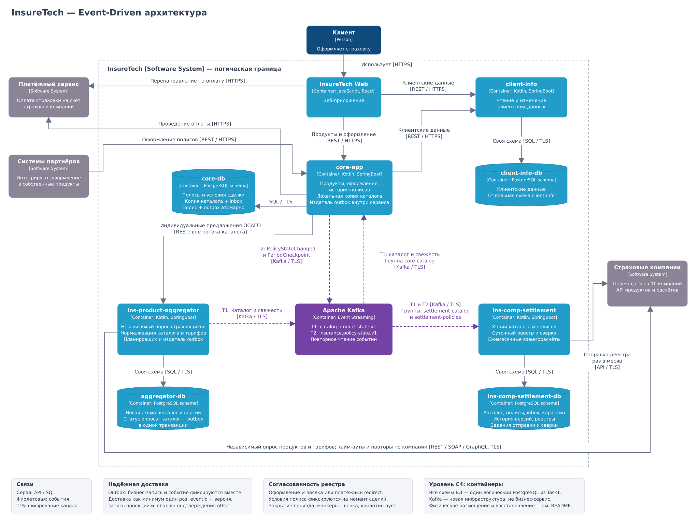

# InsureTech: доставка изменений через события

InsureTech агрегирует страховые продукты, оформляет полисы и рассчитывает агентские вознаграждения. Целевое решение сохраняет существующие сервисы, но заменяет регулярную синхронную выгрузку каталога и полисов потоками событий. Внешние API страховых компаний остаются синхронными: поддержка ими публикации событий в условии не заявлена.

[Диаграмма контейнеров C4 в draw.io](InsureTech_C4_to-be.drawio) и [её обзорная копия](architecture.svg) показывают границы ответственности, хранилища и направления передачи данных. Сплошные серые стрелки обозначают вызовы API и SQL, пунктирные фиолетовые — передачу событий. Направление событий — от производителя к брокеру и от брокера к потребителю; потребители технически сами читают Kafka.

Исходная модель: [C4-диаграмма из условия](https://code.s3.yandex.net/software-architect/InsureTech_C4_%D1%81ontainer-diagram.drawio.xml). Физическая отказоустойчивость БД и приложений согласована с [решением Task1](../Task1/README.md); добавление Kafka требует отдельного развёртывания.

## 1. Текущее состояние и риски роста

`core-app` хранит локальную копию продуктов и тарифов и обновляет её через `ins-product-aggregator` каждые 15 минут. `ins-comp-settlement` получает каталог и все оформленные за день полисы ночью. Каждый запрос каталога заставляет агрегатор заново обращаться ко всем пяти страховщикам. Планируется подключить ещё пять.

Ежесуточное формирование данных реестра и ежемесячная отправка для выплаты агентских премий — разные операции: первое задано в задании 3, второе — в общем описании проекта. Решение сохраняет обе периодичности.

| Проблема или риск | Основание и влияние | Решение |
| --- | --- | --- |
| Подтверждённые задержки и ошибки обновления каталога | В условии указаны тайм-ауты и ошибки внешних API. Синхронный ответ агрегатора зависит от нескольких внешних систем | Обновление отдельно для каждого страховщика; потребители читают локальные копии и получают изменения асинхронно |
| Усиление зависимости при росте с 5 до 10 страховщиков | Больше внешних вызовов на один сбор. Последовательный сбор увеличивает суммарную задержку, параллельный всё равно ждёт медленного участника; способ текущего вызова не указан | Ограниченные параллельные опросы, отдельные тайм-ауты и повторные попытки по страховщикам |
| Избыточный повторный сбор одного каталога | При одном планировщике каждого сервиса — 96 + 1 запуск в сутки, то есть 485 внешних вызовов сейчас и 970 после расширения, без повторов и пагинации | Единый планировщик внутри агрегатора; число внешних опросов не зависит от числа потребителей и их реплик |
| Устаревшие и разные копии тарифов | Даже при исправных API интервалы обновления дают задержку до 15 минут и суток плюс время сбора. При сбоях задержка больше | Поток версионированных изменений, контроль свежести по каждому страховщику |
| Ночной пик и зависимость settlement от core-app | Суточная выгрузка полисов растёт с продажами; сбой или повтор создаёт риск неполноты или дублей, если соответствующие механизмы не реализованы | `PolicyStateChanged` после фиксации полиса; непрерывное пополнение локального реестра |
| Риск неверной суммы взаиморасчётов | Текущий тариф может отличаться от тарифа в момент заключения договора. Состав нынешней выгрузки не описан, поэтому ошибка не считается доказанной | Хранение условий заключённого полиса и их версий; не пересчитывать прошлые продажи по текущему каталогу |
| Риск усиления нагрузки при масштабировании | Несколько реплик могут независимо запускать одинаковые задания, повторы — создавать лавину запросов | Координация заданий через общую БД, лимит параллелизма и запросов отдельно для каждой компании |
| Общие пределы БД и отсутствие оперативного контроля | По исходному описанию БД общая, сбои обнаруживались от пользователей. События добавят записи и фоновые обработчики | Отдельные схемы и пулы соединений, наблюдение за задержками и очередями; Отказоустойчивость БД из Task1 сохраняется |

Переход на события не обязан уменьшить число внешних запросов: при опросе десяти компаний раз в 15 минут получится около 960 запросов в сутки вместо 970. Основной выигрыш — устранение синхронной зависимости потребителей, независимые повторы и доставка изменений без дополнительных опросов страховщиков.

## 2. Границы ответственности и новые потоки

| Компонент | Ответственность в целевой архитектуре |
| --- | --- |
| `ins-product-aggregator` | Интеграция со страховщиками, нормализация каталога, выявление изменений, публикация событий. Собственная схема `aggregator` хранит последнее успешное состояние, версии и outbox — таблицу исходящих событий |
| `core-app` | Показ продуктов, оформление и история полисов. Читает локальный каталог, фиксирует полис и условия сделки, публикует изменения его состояния |
| `ins-comp-settlement` | Локальные копии каталога и полисов, суточные реестры, проверка полноты, ежемесячная отправка взаиморасчётов |
| `client-info` | Управление клиентскими данными; существующие запросы чтения и изменения остаются REST |
| InsureTech Web, партнёры, платёжный сервис | Существующие пользовательские, партнёрские и платёжные взаимодействия сохраняются |
| Apache Kafka | Хранение и доставка потоков, независимые позиции чтения для потребителей; бизнес-логики нет |

Новых бизнес-сервисов нет. Планировщики, публикация outbox и обработка входящих событий — внутренние части уже существующих сервисов. Новое хранилище агрегатора — его схема в том же логическом PostgreSQL, а не отдельный физический сервер. Остальные цилиндры диаграммы также обозначают логические схемы. `client-info-db` исправляет ошибочную подпись `ins-comp-settlement-db` у клиентского хранилища исходной схемы.

Выбран Kafka, поскольку один поток каталога должны независимо получать два сервиса, а данные требуется перечитывать для восстановления. Топик — именованный поток записей; партиция — его упорядоченная часть; группа потребителей — набор экземпляров, делящих чтение партиций. Разные группы получают весь поток независимо. Порядок записей гарантируется внутри партиции, а не между всеми событиями системы; порядок бизнес-изменений дополнительно защищают версии сущностей. [Модель хранения и доставки Kafka](https://kafka.apache.org/41/design/design/).

### Каталог продуктов

1. Планировщик агрегатора опрашивает компании независимо. Начальный интервал — 15 минут с небольшим случайным сдвигом запусков; это проектное допущение, уточняемое по ограничениям API. Один активный сбор на страховщика обеспечивается блокировкой в схеме `aggregator`, общей для реплик из обеих зон.
2. Каждому API задаются тайм-аут, предел одновременных запросов и собственный бюджет повторов. После серии ошибок вызовы временно приостанавливаются (circuit breaker), затем выполняется пробная попытка. Сбой компании A не откладывает публикацию компании B.
3. Успешный ответ проверяется и нормализуется. Изменившееся состояние продукта и событие записываются одной транзакцией. При многостраничном ответе сравнение выполняется только после получения полного согласованного снимка.
4. Ошибка и неполный ответ не считаются пустым каталогом. Продукт снимается с продажи по явному признаку неактивности или после подтверждённого полного снимка, где его больше нет. Сначала публикуется `active=false`, физическое удаление истории не выполняется.
5. Даже если каталог не изменился, успешный полный опрос фиксирует `CatalogSourceChecked` с `insurerId`, `checkedAt` и идентификатором проверки. Статус проверки и outbox фиксируются вместе. Иначе молчание потока нельзя отличить от сбоя опроса и потребители ошибочно признают неизменившийся каталог устаревшим.
6. `core-app` и `ins-comp-settlement` непрерывно читают каталог в **разных** группах `core-catalog` и `settlement-catalog`, обновляя свои копии. Экземпляры одного сервиса в двух зонах используют одну и ту же группу, чтобы не дублировать работу.

Время доставки состоит из интервала обнаружения изменения у страховщика, обработки и задержки потока. Kafka не делает тарифы мгновенно актуальными, если внешний источник опрашивается раз в 15 минут. Успешная проверка источника и применение всех обновлений потребителем — разные показатели: событие проверки не означает, что остальные партиции уже обработаны. Предлагаемые сигналы: предупреждение после двух неуспешных циклов, отображение времени обновления, запрет нового оформления при истёкшем `validUntil` или неподтверждённой цене. Допустимый возраст каталога и способ проверки цены перед заключением необходимо согласовать со страховщиками; это не новые обязанности другого сервиса.

### Оформленные полисы

`core-app` публикует `PolicyStateChanged`, когда фиксирует подтверждённое оформление, изменение или аннулирование полиса. Создание заявки и перенаправление на оплату ещё не означают оформленный полис. Публикация не зависит от того, через Web или партнёрский API пришёл запрос.

`ins-comp-settlement` читает поток в группе `settlement-policies`, сохраняет полисы и историю корректировок. Ежесуточная массовая REST-выгрузка из `core-app` удаляется из штатного процесса. Ночной расчёт использует собственное хранилище. В событии сохраняются версия продукта, страховая премия, валюта, условия агентского вознаграждения либо их зафиксированная ссылка и исходные показатели расчёта. По текущему каталогу прошлые полисы не переоцениваются.

REST остаётся для Web → core-app, партнёры → core-app, Web/core-app → client-info, платежей, агрегатор → страховщики и отправки реестров settlement → страховщики. Индивидуальные запросы предложений ОСАГО не заменяются массовым потоком каталога; их процесс относится к заданию 4. Служебные выгрузки для первоначальной загрузки и сверки допустимы, но не вызываются на пользовательском пути.

## 3. Transactional Outbox и обработка событий

**Transactional Outbox применяется в `core-app` и `ins-product-aggregator`.** Бизнес-изменение и запись о необходимости отправить событие фиксируются одной локальной транзакцией PostgreSQL. Это исключает окно «полис сохранён, процесс упал до публикации». Прямая независимая запись в БД и Kafka не используется. [Описание паттерна](https://microservices.io/patterns/data/transactional-outbox.html).

В каждом сервисе фоновый издатель читает неподтверждённые строки outbox, отправляет их в Kafka и отмечает отправку **после** подтверждения брокером. Строка остаётся для повтора, если подтверждение не получено. Издатели разных реплик делят работу с помощью блокировок/аренд в своей схеме; на один ключ сущности не запускают несколько отправок одновременно. После аварии аренда истекает, обработку подхватывает другая реплика. Для задержавшегося старого издателя и повторов всё равно предусмотрена проверка версий у потребителя.

Выбрана публикация опросом таблицы из сервиса: она не требует отдельного сервиса или подключения к журналу БД. Цена — дополнительные запросы к PostgreSQL; нужны пакетное чтение, индекс по состоянию/порядку отправки, лимит пакета и удаление старых подтверждённых строк. Публикация из журнала изменений БД может быть рассмотрена при подтверждённой перегрузке опросом, но не добавляется в текущую схему.

Сбой после отправки в Kafka, но до отметки в outbox приводит к повторной доставке. Поэтому гарантия — **как минимум одна доставка**, а не «ровно один раз» от БД до БД. Идемпотентность производителя Kafka ограничивает часть сетевых дублей, но не заменяет защиту бизнес-обработки.

Потребитель выполняет в одной транзакции своей схемы:

1. Регистрирует `eventId` в таблице обработанных событий (inbox) с уникальным ограничением.
2. Проверяет `entityVersion`, сохраняет историю и изменяет локальную проекцию — копию данных для чтения.
3. Фиксирует транзакцию; только затем подтверждает позицию чтения Kafka (offset).

Повтор известного `eventId` не меняет данные. Старая версия не перезаписывает новую. Для разных событий одной версии с разным содержимым создаётся ошибка сверки. Полные состояния каталога позволяют применить более новую версию; пропуск версий полиса требует восстановления истории и блокирует завершение соответствующего реестра. Подтверждение Kafka до записи в БД запрещено. Потеря подтверждения после записи приводит к безопасному повтору.

`ins-comp-settlement` не нужен outbox для простого обновления локальной копии: здесь он потребитель, а не производитель Kafka. Для отправки внешнего реестра он хранит отдельное задание отправки в своей транзакции. Единый исполнитель, `registryId` и версия предотвращают параллельную отправку из двух зон. Если API страховщика не поддерживает идемпотентность, неоднозначный тайм-аут требует проверки статуса или ручной сверки, а не безусловного повторения финансовой операции.

## 4. Контракты, восстановление и полнота реестра

| Поток | Производитель → потребители | Ключ и содержимое |
| --- | --- | --- |
| `catalog.product-state.v1` | aggregator → core, settlement | Ключ `product:insurerId:productId`; `ProductStateChanged`: полное состояние, тарифы с периодами действия, `active`, версия продукта. Отдельный ключ `source:insurerId` для `CatalogSourceChecked`: время успешного полного опроса, включая опрос без изменений |
| `insurance.policy-state.v1` | core → settlement | Ключ `policyId`; `PolicyStateChanged`: полное состояние и версия полиса, компания, продукт/версия, дата оформления, статус, зафиксированные суммы и условия расчёта |

Для записей проверки источника сущностью является страховщик, для остальных — продукт или полис. Общие поля: `eventId` (стабильный идентификатор для повторов), `eventType`, `schemaVersion` (версия формата), `entityVersion` (монотонный номер изменения сущности), `occurredAt`, `correlationId` для связи журналов. Время события не используется вместо номера версии. При отсутствии версии у страховщика агрегатор назначает её при фиксации изменения; устаревший завершившийся опрос не должен перезаписать результат более нового. Персональные документы и контакты в потоки не включаются; состав необходимых для взаиморасчётов полей уточняется отдельно.

Совместимые дополнения контракта делают необязательными; потребители допускают неизвестные поля. Несовместимые изменения требуют новой версии топика, параллельного чтения/сверки и переключения потребителей. Новые версии проверяются контрактными тестами до выпуска.

### Полнота и поздние события

Нулевое отставание от Kafka не доказывает полноту: часть полисов может ещё находиться в outbox. В `core-app` формируется контрольный срез периода с идентификатором и фиксированной границей бизнес-изменений. Он содержит идентификатор среза, бизнес-период и его часовую зону, набор ожидаемых партиций и контрольные показатели. Каждый `PeriodCheckpoint` указывает свою партицию и границу среза, имеет стабильный `eventId` и безопасен при повторе. Сводный срез содержит число полисов, суммы по компании и валюте и контрольные данные для сверки. Издатель публикует в **каждую** партицию потока полисов маркер `PeriodCheckpoint` только после подтверждения отправки всех событий среза, относящихся к этой партиции. Маркер — техническое событие того же потока; он не заменяет `PolicyStateChanged`.

Settlement сохраняет события/версии для расчёта на границу среза, дожидается всех маркеров, отсутствия необработанных ошибок и сверяет количество и суммы с контрольными данными источника. Срез должен быть получен согласованно в БД `core-app`; протокол границы, распределения по партициям и сверки реализуется и тестируется до перехода. Сравнение только с текущим изменяемым состоянием таблиц недостаточно. При расхождении реестр остаётся предварительным, выполняется сверка по идентификаторам и повторная доставка.

Позднее оформление или корректировка уже закрытого периода создают следующую версию реестра/корректировку с отдельным идентификатором. Часовой пояс бизнес-дня, момент закрытия и правила корректировок необходимо согласовать. Это особенно важно для ежемесячной окончательной отправки. Проблемное событие не должно молча исключаться из финансового реестра.

### Начальная загрузка и повторное чтение

Начальные допущения: каталог хранится с уплотнением по ключу (Kafka сохраняет последнее состояние каждого продукта и последнюю проверку каждого источника), поток полисов — с полной историей 90 дней. `active=false` сохраняется как обычное состояние, чтобы при восстановлении не вернуть снятый продукт. Срок 90 дней и ёмкость дисков нужно уточнить по объёмам и максимальному сроку недоступности потребителей; история полисов в БД хранится независимо от этого окна.

Первичная загрузка и восстановление за пределами хранения выполняются через согласованный снимок данных производителя. До снимка фиксируются позиции потока и включается надёжная публикация outbox; изменения на время выгрузки продолжают попадать в поток. Снимок включает версии сущностей и не затирает более новую уже обработанную версию. После загрузки потребитель перечитывает поток с сохранённых позиций и сверяется с источником. Если позиции уже удалены, нужен новый снимок. Для каталога возможно восстановление чтением уплотнённого потока с начала; для финансовой истории уплотнённого каталога недостаточно.

Сначала события читаются параллельно старому процессу в отдельные проекции без внешней отправки. Сравниваются версии каталога, полисы и суммы по периоду. После успешной сверки переключается чтение и отключаются периодические REST-выгрузки. Только один путь имеет право отправлять реестры; возврат к старому чтению не должен повторно отправлять уже подтверждённые документы.

## 5. Отказы, эксплуатация и проверка решения

Kafka добавляет зависимость, но её временный отказ не должен откатывать уже совершённую бизнес-транзакцию: события накапливаются в outbox. Контролируются возраст и размер очереди; при угрозе заполнения диска ограничиваются новые операции, требующие гарантированной доставки. Бесконечный буфер не предполагается.

Начальная конфигурация — три брокера и три голосующих контроллера Kafka по трём зонам, три копии партиций, подтверждение всех синхронных копий (`acks=all`), минимум две синхронные копии (`min.insync.replicas=2`), идемпотентный producer, запрет выбора отставшей копии лидером. Это дополнение к двум зонам приложений из Task1: третья зона теперь размещает также инфраструктуру Kafka. Два независимых кластера приложений используют один логический кластер Kafka. При потере кворума публикация приостанавливается; настройки требуют испытаний на выбранной инфраструктуре. Схема C4 не изображает отдельные узлы и не заменяет схему размещения Task1.

Партиционирование каталога выполняется по продукту, полисов — по полису. Число партиций определяется измерениями потока и времени догоняющего чтения; максимальное число активно читающих экземпляров группы ограничено числом партиций. Изменение числа партиций может изменить распределение ключей: его проводят как контролируемую миграцию с проверкой порядка и протокола срезов. Сохранение общего PostgreSQL оставляет конкуренцию за ресурсы; Kafka не устраняет этот предел.

| Сбой | Поведение и проверка |
| --- | --- |
| Один страховщик не отвечает | Другие каталоги обновляются; старое состояние не удаляется. Проверить частичный ответ, тайм-аут и восстановление |
| Падение между записью полиса и отправкой | Полис и outbox либо оба зафиксированы, либо оба отсутствуют. После восстановления событие доставляется |
| Падение после отправки или записи потребителя | Повтор не создаёт второй полис и не удваивает сумму; позиции подтверждаются только после фиксации БД |
| События пришли повторно или вне порядка | Проверить `eventId`, версии, восстановление пропуска и отсутствие отката состояния |
| Потребитель недоступен | После возврата догоняет поток; при выходе за срок хранения выполняет снимок и сверку |
| Необрабатываемое событие | После ограниченных повторов сохраняется в карантин своей схемы вместе с причиной и исходной позицией. Позиция продвигается только после надёжной записи карантина; закрытие затронутого периода остаётся заблокированным до исправления и повторной обработки; если определить период нельзя, блокируется финализация всех срезов, включающих эту позицию |
| Ночной/месячный срез при задержке outbox | Отсутствие маркера или несовпадение сумм блокирует финализацию, а не формирует неполный реестр |
| Потеря зоны, восстановление БД | Проверить кворум Kafka, возобновление издателей, дубли и сверку БД с опубликованными событиями |

Наблюдаются: время последнего успешного опроса по страховщику, возраст старейшей записи outbox, задержка от фиксации до применения, отставание групп, размер карантина, ошибки сверки, заполнение дисков и длительность закрытия периода. Предлагаемые начальные пороги — 1 минута для возраста outbox и 5 минут для задержки применения полисов; это ориентиры для испытаний, а не согласованный уровень обслуживания.

Соединения шифруются; права Kafka ограничивают агрегатор публикацией каталога, core — чтением каталога и публикацией полисов, settlement — чтением обоих потоков. Доступ к карантину и служебным снимкам ограничен. Outbox и inbox используют запись/согласованное чтение основного узла БД, а не отстающую реплику.

**Остаточный риск Task1:** асинхронная репликация PostgreSQL допускает потерю недавно зафиксированных транзакций при аварийном переключении. Событие уже могло попасть в Kafka, а породившая его запись — потеряться в БД. Transactional Outbox не устраняет этот сценарий. После такого восстановления финансовая отправка приостанавливается, выполняется сверка БД и потока с журналом/резервными копиями, затем возобновление. Если бизнес требует нулевой потери подтверждённых полисов, режим репликации БД необходимо пересмотреть; заявлять такую гарантию при принятом допустимом окне потери данных (RPO) нельзя.
