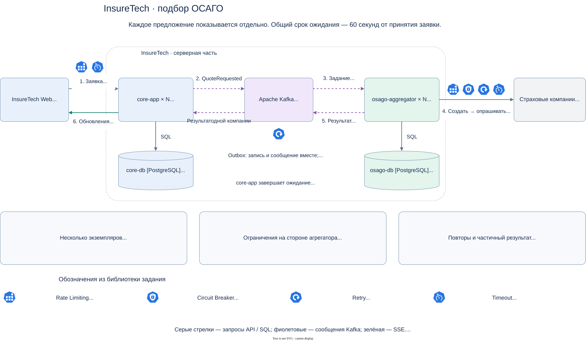
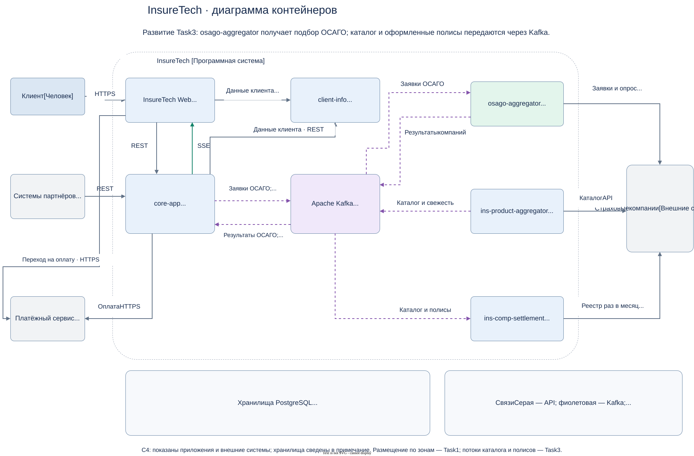

# Продажа ОСАГО онлайн

Клиент заполняет одну заявку и получает предложения страховых компаний по мере их готовности. `core-app` отвечает за заявку, показ предложений, выбор, оплату и оформление полиса. Новый `osago-aggregator` только отправляет заявки страховщикам и опрашивает результаты.

[Редактируемая схема draw.io](InsureTech_OSAGO_to-be.drawio) содержит два листа: «ОСАГО» — основной сценарий и защита от сбоев; «Контейнеры» — общая архитектура, развивающая [Task3](../Task3/README.md). Каждый сервис на схеме обозначает несколько экземпляров. Физическое размещение остаётся описанным в [Task1](../Task1/README.md).

## 1. Основные решения

| Вопрос | Решение и причина |
| --- | --- |
| Связь `core-app` и `osago-aggregator` | Асинхронные сообщения через существующую Kafka. Отдельная команда запускает подбор; результат каждой компании возвращается отдельным событием. Подход из Task3 сохраняется |
| Хранилище агрегатора | Собственная схема `osago` в PostgreSQL. Нужна для восстановления опросов после перезапуска и распределения работы между экземплярами |
| Связь с браузером | REST для создания и чтения заявки; SSE (Server-Sent Events) — поток обновлений от сервера к браузеру. Отдельное предложение отправляется сразу после обработки, без ожидания остальных |
| Работа со страховщиками | REST: создать заявку, затем опрашивать предложение по выданному идентификатору. Компании обрабатываются независимо и параллельно в пределах их лимитов |
| Граница ожидания | Общий срок `deadlineAt = acceptedAt + 60 секунд`. Очередь, внешние вызовы и доставка результатов входят в этот срок; повторы его не продлевают |

Общий срок от принятия заявки — проектное уточнение требования «не более 60 секунд»: пользователь не ждёт дополнительно из-за очереди. «Сразу» означает отправку каждого полученного результата без накопления общего списка. При внешнем опросе есть задержка обнаружения, а затем — обработки и сети. Начальный ориентир для проверки: от получения ответа агрегатором до показа в браузере — не более 1 секунды для 95% результатов при расчётной нагрузке. Это целевой показатель, который ещё нужно измерить.

## 2. Как проходит подбор

1. Браузер отправляет данные автомобиля и водителей в `core-app`. Сервис проверяет данные и доступ клиента, фиксирует заявку, список доступных для продукта страховщиков и срок ожидания. В той же транзакции сохраняет команду в **outbox** — таблицу сообщений, ожидающих отправки. Возвращает `202 Accepted`, `applicationId` и `deadlineAt`, не ожидая страховщиков.
2. Браузер открывает поток SSE для этой заявки. Сначала получает текущее состояние, затем отдельные обновления. Уже пришедшие предложения сразу видны и доступны для выбора.
3. Фоновый отправитель `core-app` публикует команду в Kafka. `osago-aggregator` сохраняет по одному заданию на пару «заявка — страховщик». Внешние вызовы выполняются отдельными обработчиками внутри агрегатора; чтение Kafka не блокируется на все 60 секунд.
4. Обработчик создаёт внешнюю заявку и сохраняет её идентификатор. Затем примерно раз в 2 секунды запрашивает результат, пока он не готов или не истёк срок. Небольшой случайный сдвиг между опросами распределяет нагрузку. Одновременно выполняется не более одного вызова по одному заданию.
5. Полученное предложение, отказ или окончательная ошибка сохраняются вместе с событием в outbox агрегатора. Через Kafka событие попадает в `core-app`, сохраняется в его БД и передаётся в SSE. Отказ одной компании не задерживает остальные.
6. Подбор заканчивается, когда все компании ответили или истекли 60 секунд. Для оставшихся компаний показывается «Ответ не получен вовремя»; найденные предложения сохраняются. Если предложений нет, интерфейс явно сообщает об этом и позволяет начать новый подбор.

`core-app` самостоятельно завершает ожидание по сохранённому сроку, даже если агрегатор или Kafka недоступны. Проверка срока и обновление заявки выполняются атомарно; после завершения новые предложения в эту заявку не добавляются. Ответ, который не успел сохраниться в `core-app` до срока, считается опоздавшим. Агрегатор также прекращает внешние вызовы по сроку и не запускает просроченные задания после восстановления. В браузере отсчёт заканчивается через 60 секунд даже при потере соединения; в таком случае он сообщает о потере связи и пытается получить итог через REST.

Выбор предложения и дальнейшее оформление остаются в `core-app`. Перед оформлением он проверяет принадлежность предложения заявке и срок его действия. Ожидание подбора в 60 секунд не означает, что предложение действительно только 60 секунд. Взаиморасчёты получают событие оформленного полиса по существующему потоку Task3.

## 3. API и данные

### Браузер → core-app

Все адреса ниже — предлагаемый контракт. Доступ идёт по HTTPS, заявка доступна только своему клиенту. SSE использует ту же защищённую сессию в cookie, что и веб-приложение; для изменяющих запросов нужна защита от подделки запросов (CSRF).

| Запрос | Назначение |
| --- | --- |
| `POST /api/osago/applications` | Создать подбор. Данные автомобиля и водителей, заголовок `Idempotency-Key`. Ответ `202`: идентификатор, состояние `collecting`, `deadlineAt` |
| `GET /api/osago/applications/{id}` | Получить текущий список предложений, состояния компаний и общий статус |
| `GET /api/osago/applications/{id}/events` | Открыть SSE с типом ответа `text/event-stream`: `snapshot` — текущее состояние, `insurer-result` — результат компании, `completed` — конец подбора |
| `POST /api/osago/applications/{id}/selection` | Сохранить выбранное `offerId`; последующие шаги оплаты и выпуска выполняет `core-app` |

Повтор создания с тем же ключом и теми же данными возвращает ту же заявку; другой набор данных с тем же ключом — `409 Conflict`. Ключ привязан к клиенту. Выбор предложения тоже защищён от повторной отправки.

У SSE-события есть последовательный номер внутри заявки. При обрыве браузер переподключается с `Last-Event-ID`, и сервер дочитывает пропущенные обновления из БД. При первом подключении или отсутствии старой истории передаёт полный снимок с текущим номером, затем более новые события. Снимок и его номер читаются согласованно. Браузер игнорирует уже применённые номера и закрывает поток после `completed`. Такое переподключение предусмотрено [стандартом SSE](https://html.spec.whatwg.org/multipage/server-sent-events.html).

Для SSE отключается буферизация ответа на прокси, служебное сообщение поддерживает соединение раз в 15 секунд; тайм-аут бездействия прокси должен быть больше этого интервала, например 30 секунд. Служебные сообщения не продлевают срок подбора.

### core-app ↔ osago-aggregator

API агрегатора для `core-app` — два контракта сообщений. Отдельный синхронный REST API для ожидания результата не требуется.

| Топик Kafka | Сообщение и содержимое |
| --- | --- |
| `osago.requests.v1` | `QuoteRequested`: `eventId`, `applicationId`, `deadlineAt`, список `insurerId`, необходимые для расчёта данные автомобиля и водителей |
| `osago.results.v1` | `InsurerQuoteFinished`: `eventId`, `applicationId`, `insurerId`, итог `offered / rejected / error / timed_out`; для предложения — `offerId`, цена, условия и срок действия |

Ключ обоих потоков — `applicationId`. `eventId` неизменен при повторной доставке. Для каждой компании в одном подборе фиксируется один итог; новый расчёт создаёт новую заявку. Доступ к топикам ограничен этими сервисами, соединения шифруются; персональные данные не попадают в технические журналы. Состав полей и срок хранения сообщений следует согласовать перед реализацией.

| Хранилище | Что сохраняется |
| --- | --- |
| `core-db` | Заявка, владелец, срок, выбранные страховщики, результаты, выбор клиента, ключи повторов, outbox и журнал SSE |
| `osago-db` | Задания опроса, внешние идентификаторы заявок, результаты, время следующего вызова, срок, владелец задания и outbox |

Оба хранилища — отдельные схемы существующего PostgreSQL. Сервисы обращаются только к своим схемам. У производителей запись состояния и outbox атомарна. Получатель фиксирует `eventId` вместе с данными и только затем подтверждает чтение Kafka; повтор события не создаёт второе задание или второе предложение. Это тот же механизм доставки с возможными повторами, что в Task3.

## 4. Несколько экземпляров

Все экземпляры `osago-aggregator` читают команды в одной группе потребителей Kafka; все экземпляры `core-app` читают результаты в своей общей группе. Сообщение обрабатывает один экземпляр группы. Количество частей топика (партиций) должно позволять задействовать нужное число обработчиков; оно выбирается после замеров.

Обработчики агрегатора берут задания из общей схемы `osago` через краткую блокировку и аренду — право выполнять задание до указанного времени. Сетевой вызов происходит вне транзакции. После падения обработчика аренда истекает и задание получает другой экземпляр. Результат сохраняется только с актуальным номером аренды: старый обработчик не может перезаписать результат нового. Уникальная пара `(applicationId, insurerId)` защищает от повторного создания задания, а внешний ключ идемпотентности — от дублирования заявки у страховщика, если его API поддерживает такой ключ.

Результат Kafka может получить экземпляр `core-app`, к которому браузер не подключён. Поэтому в транзакцию сохранения результата и записи журнала SSE он включает PostgreSQL `NOTIFY` с идентификатором заявки. Каждый экземпляр `core-app` слушает уведомления (`LISTEN`), читает новые записи своего журнала SSE для подключённых к нему клиентов и отправляет их в браузеры. Уведомление получают все слушающие соединения после фиксации транзакции. См. [документацию PostgreSQL](https://www.postgresql.org/docs/current/sql-notify.html).

На экземпляр нужен один отдельный слушатель БД, а не соединение БД на каждый браузер. После запуска или разрыва связи он сначала возобновляет подписку, затем дочитывает журнал для активных потоков. При открытии SSE локальная подписка регистрируется до чтения снимка; номера событий убирают возможные повторы. Уведомления лишь ускоряют доставку, данные хранятся в журнале. Для пропущенных сигналов раз в секунду выполняется пакетная проверка активных заявок. Порядок восстановления соответствует [правилам LISTEN](https://www.postgresql.org/docs/current/sql-listen.html).

Привязка клиента к определённому экземпляру не требуется. При падении пода браузер переподключается к другому. Завершение по сроку также выполняют фоновые обработчики `core-app` через общую БД; условное изменение состояния позволяет завершить заявку только один раз.

## 5. Защита от перегрузки и сбоев

На листе «ОСАГО» используются значки из [библиотеки задания](https://code.s3.yandex.net/software-architect/%D0%9E%D0%B1%D0%BE%D0%B7%D0%BD%D0%B0%D1%87%D0%B5%D0%BD%D0%B8%D1%8F%20%D0%BF%D0%B0%D1%82%D1%82%D0%B5%D1%80%D0%BD%D0%BE%D0%BC%20%D0%BE%D1%82%D0%BA%D0%B0%D0%B7%D0%BE%D1%83%D1%81%D1%82%D0%BE%D0%B8%CC%86%D1%87%D0%B8%D0%B2%D0%BE%D1%81%D1%82%D0%B8.drawio.xml). Значки на связи указывают место применения; параметры ниже — начальные настройки для испытаний.

| Паттерн | Где и как применяется |
| --- | --- |
| **Rate Limiting** — ограничение частоты | В `core-app`: лимит создания и числа активных подборов на клиента, отдельные квоты партнёрам. Превышение — `429` и время до повтора. В агрегаторе: общий для всех его экземпляров лимит вызовов и параллельных запросов к каждой компании. Счётчики и выделение разрешений координируются в схеме `osago`; квоты берутся из договора API |
| **Circuit Breaker** — временная остановка вызовов | Отдельно для каждого страховщика. Например, после пяти подряд сетевых ошибок или `5xx` вызовы приостанавливаются на 10 секунд, затем допускается одна проба. Состояние и право пробы общие в БД. Отказ в страховании и ответ «ещё не готово» не считаются техническими сбоями |
| **Retry** — повтор | Внешний GET: до двух дополнительных попыток после временной ошибки, паузы около 0,5 и 1 секунды со случайным сдвигом. `429` учитывает `Retry-After`. После исчерпания попыток фиксируется ошибка компании. Обычный опрос незавершённой заявки раз в 2 секунды — отдельное действие. Kafka/outbox повторяют отправку до подтверждения, но просроченная команда уже не запускает подбор |
| **Timeout** — ограничение времени | На один внешний вызов: не более 5 секунд и не больше оставшегося общего срока. Очереди, паузы и открытый Circuit Breaker расходуют те же 60 секунд. После срока вызовы прекращаются; полученные раньше предложения остаются доступны |

Повтор внешнего POST разрешён только при подтверждённой поддержке идемпотентности — безопасного повтора с тем же ключом без создания второй заявки. В условии такая поддержка не обещана. Перед вызовом в БД фиксируется начало отправки. Если POST завершился неоднозначным тайм-аутом или процесс упал до сохранения внешнего идентификатора, автоматически создавать заявку ещё раз нельзя: фиксируется ошибка этой компании. Если срок после перезапуска ещё не истёк, известный внешний идентификатор позволяет продолжить безопасные GET-запросы.

При открытом Circuit Breaker задание ждёт разрешения на пробу только до общего срока. Ограничения компаний не умножаются на число подов. Входные квоты клиентов также общие для экземпляров `core-app`: проверка и изменение счётчиков выполняются атомарно в `core-db`. При известной недоступности Kafka или чрезмерной очереди `core-app` временно отклоняет новые подборы с `503`, а ранее принятые заканчивает по сроку. Частые проверки квот и заданий создают нагрузку на общую БД; этот расход нужно измерить вместе с основными запросами.

## 6. Нагрузка и проверка перед запуском

Для расчёта принят рост до десяти страховщиков из Task3. Пиковые 2500 активных клиентов дают около 2500 SSE-соединений и до `2500 × 10 = 25 000` заданий. При опросе раз в 2 секунды до завершения всех заявок верхняя оценка — `25 000 / 2 = 12 500` GET-запросов в секунду суммарно, или 1250 на компанию, плюс создание заявок и повторы. Для пяти компаний суммарная оценка вдвое меньше. Это возможная нагрузка, а не известная пропускная способность API.

Обработчики используют неблокирующие HTTP-вызовы и ограниченные пулы соединений. `osago-aggregator` масштабируется горизонтально по числу ожидающих заданий и их возрасту, `core-app` — по нагрузке запросов и активных SSE-соединений. Увеличение числа подов помогает только в пределах доступной БД и квот страховщиков. Если компания допускает меньше запросов, интервал опроса придётся увеличить или согласовать более высокую квоту; иначе часть клиентов не получит её предложение за 60 секунд. Пик одновременных клиентов не задаёт скорость создания заявок, поэтому нужно проверить и резкий старт 2500 подборов, и устойчивый поток.

| Проверка | Ожидаемый результат |
| --- | --- |
| Компании отвечают через 2, 15 и более 60 секунд | Первые два предложения показываются по отдельности; после общего срока третий результат не добавляется |
| Одна компания возвращает `429`, `5xx` или зависает | Соблюдаются её квота и паузы; другие компании продолжают обработку |
| Повтор POST браузера и повтор сообщений Kafka | Одна заявка, одно задание на компанию и один итог |
| Падение агрегатора после создания внешней заявки | С известным внешним ID опрос продолжается; неоднозначный POST без идемпотентности не повторяется |
| Результат получает другой под core-app; затем падает под с SSE | Предложение доходит через уведомление БД; после переподключения пропущенные обновления восстанавливаются |
| Kafka задерживает сообщение дольше 60 секунд | Интерфейс заканчивает ожидание; агрегатор не отправляет просроченную заявку |
| 2500 активных клиентов, 10 компаний, несколько экземпляров | Измерены задержка до экрана, длина очередей, внешняя частота запросов, нагрузка БД и число SSE-соединений; общие лимиты соблюдены |

Для испытаний нужны заглушки двух внешних REST-эндпоинтов с управляемой задержкой и ошибками. Реальные квоты, поддержка ключей повторов и срок действия предложений уточняются у страховщиков. Параметры масштабирования выбираются по этим замерам, а не по количеству пользователей без измерения потребления ресурсов.

Асинхронная репликация PostgreSQL из Task1 сохраняет риск потери последних записей при аварийном переключении. Outbox не устраняет этот риск. После такого сбоя нужны сверка заявок и результатов и восстановление уведомлений; для оформления полисов действуют ограничения и сверка из Task3.

